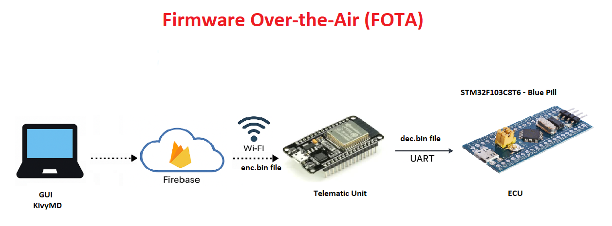
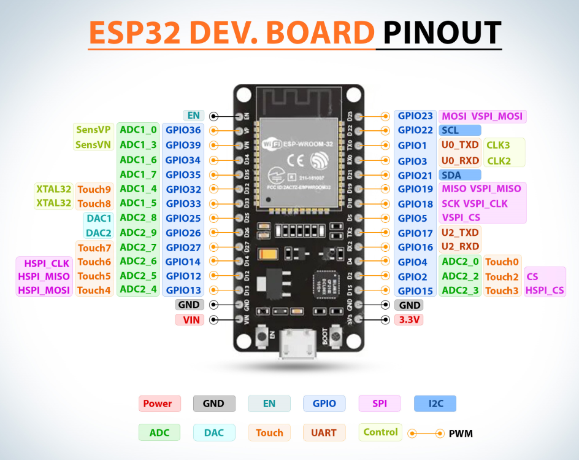
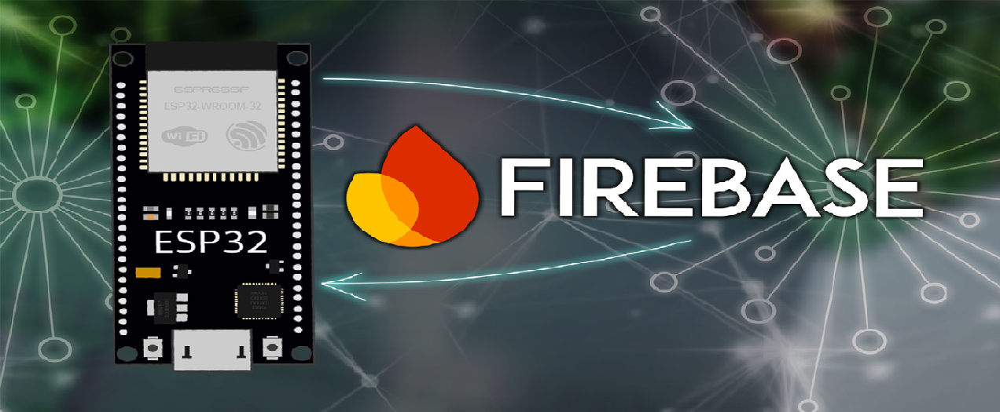
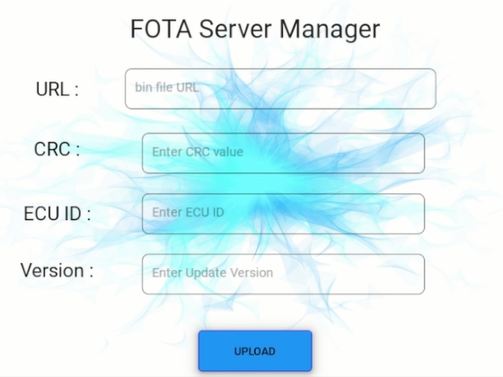

 # Firmware Over-The-Air (FOTA) System with STM32, Firebase, and ESP32

This project implements a secure FOTA (Firmware Over-The-Air) update system for STM32 microcontrollers using an ESP32 module. Firmware is stored on Firebase, encrypted using AES, and transferred to an external STM32 ECU over UART.

## Over-the-air updates
After deploying an IoT device, it doesn’t mean the development is finished forever. On the contrary,
this is the most important stage in the life cycle of an IoT product and still requires active
development. We might want to add new features as a response to the users’ needs or it might be
a necessity to improve the product security after discovering a potential risk. In either case, we
need to have a means to update the firmware remotely without physically touching the deployed
IoT products. Over-the-air (OTA) update techniques provide this capability.

## Benefits of FOTA updates
Firmware over-the-air updates provide multiple benefits both to users and device vendors:
1. User convenience: Users do not have to manually check for updates and do not have to connect their devices to their computers and download special software to update them.
2. Improved security: Devices that are up to date are more secure, and updates will not be “put off” until a later time, or forgotten about.
3. New features, bug fixes, and better device performance: FOTA ensures that users have the latest bug fixes and features, improving functionality, stability, and performance.
4. Better outcomes for manufacturers: Rather than recalling faulty devices, manufacturers can deploy firmware over-the-air updates to fix devices in the field. They can also test updates on a subset of users who have opted in, to make sure that updates are reliable before wider deployment, improving reliability and brand perception.

## FOTA Implementation

### Hardware Used
1. STM32F103

2. ESP32

### Software Tools
1. PlatformIO or Arduino IDE (for ESP32)
2. STM32CubeIDE (for STM32 firmware)
3. Firebase Console
4. Python KivyMD (for GUI upload)

### Connection between Server and ECU

I used ESP32 as telematic unit for connection between server(Firebase) and ECU(STM32F103 Blue Pill)

### Graphical User Interface

KivyMD-based GUI allows uploading firmware to Firebase to make it easier for the user to upload updates to firebase and the relate information of the update.

## How It Works

1. User uploads encrypted .bin file to Firebase.
2. ESP32 connects to Firebase to check for new firmware updates.
3. Secure update: Encrypted .bin firmware is downloaded then Decrypted (Using AES-256-bit Encryption and Decryption) and sent to the STM32 over UART.
4. STM32F103 (Blue Pill) decides whether to accept the update or continue running the current application.
5. Custom Bootloader receives and flashes the firmware.
6. GUI built with KivyMD lets you upload the .bin file to Firebase with a user-friendly interface.
7. LCD on STM32 displays status updates during the bootloading process

## Hardware Structure

